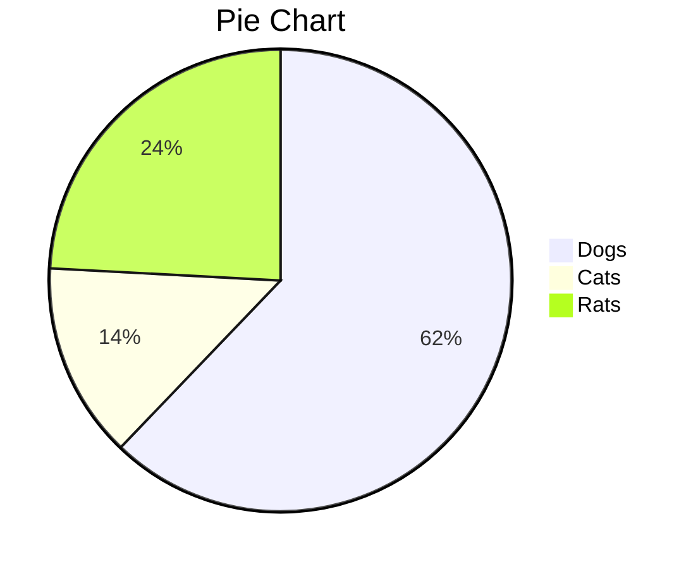
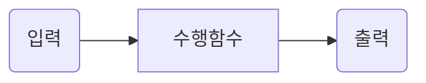
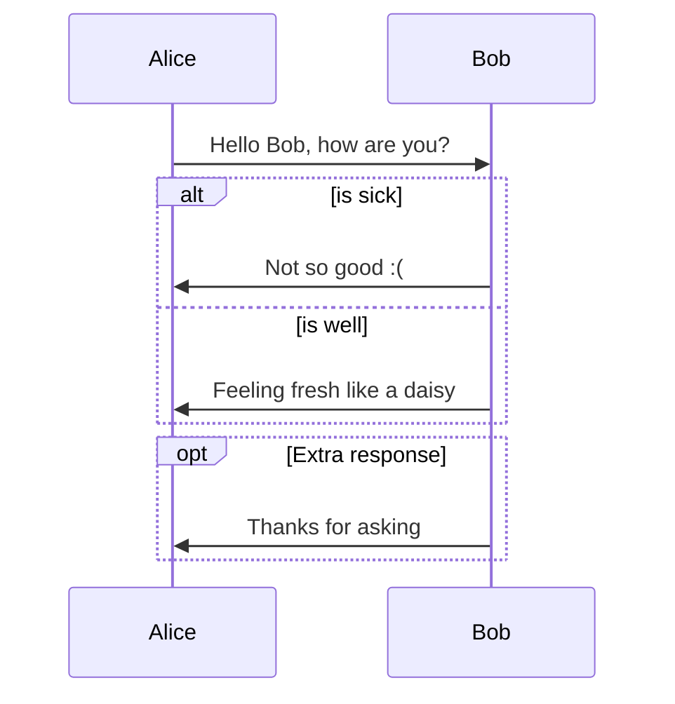
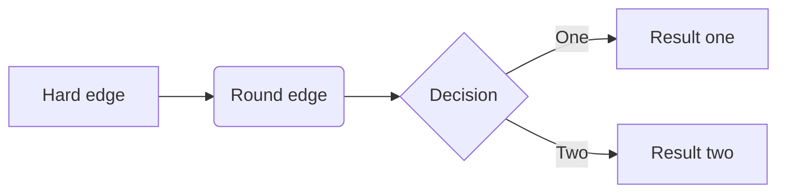
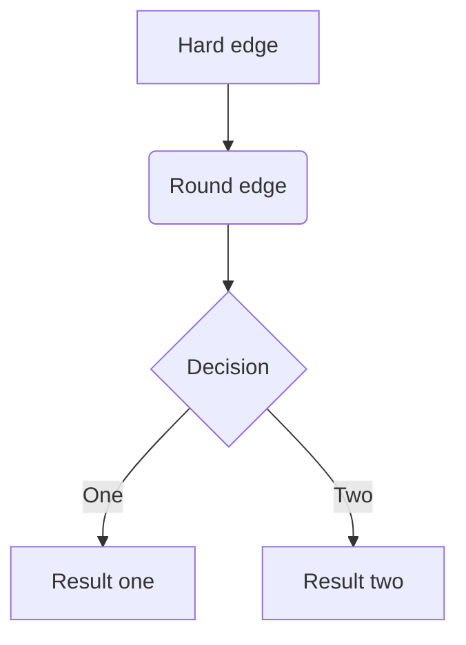
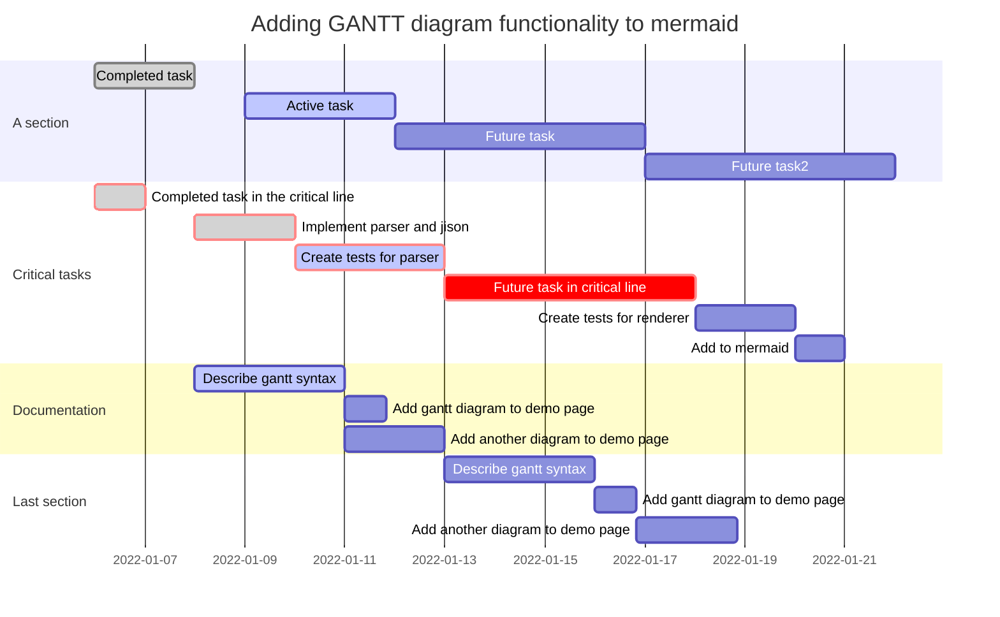
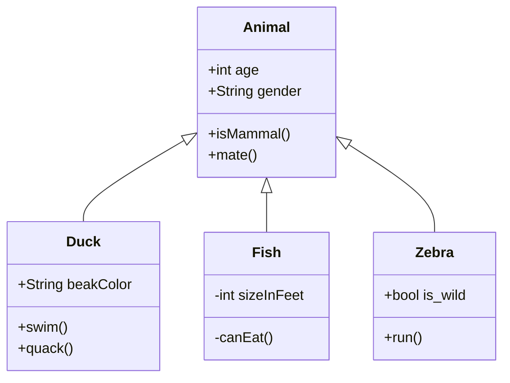
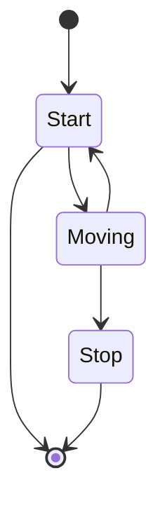

# Markdown Mermaid cheat sheet

- [https://mermaid.live/edit](https://mermaid.live/edit)


## Pie chart




## Flow chart 1



## Flow chart 2

```flow
st=>start: Start
op=>operation: Your Operation
cond=>condition: Yes or No?
e=>end

st->op->cond
cond(yes)->e
cond(no)->op
```

## Flow chart 3


## Flow chart 4




## Gantt chart
- Example with selection of syntaxes




## Sequence diagram 

```sequence
Alice->Bob: Hello Bob, how are you?
Note right of Bob: Bob thinks
Bob-->Alice: I am good thanks!
```

## Class diagram



## State diagram




